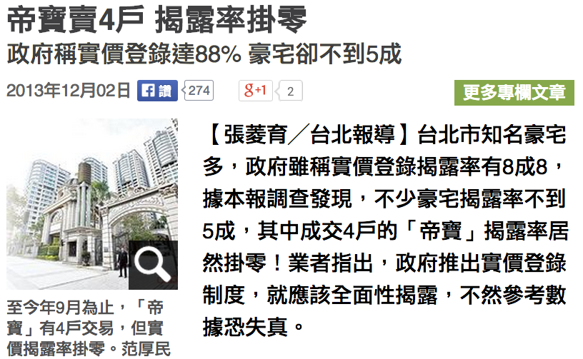
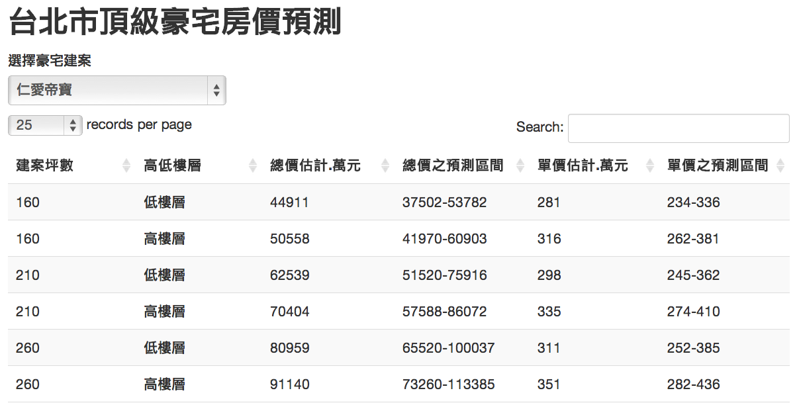
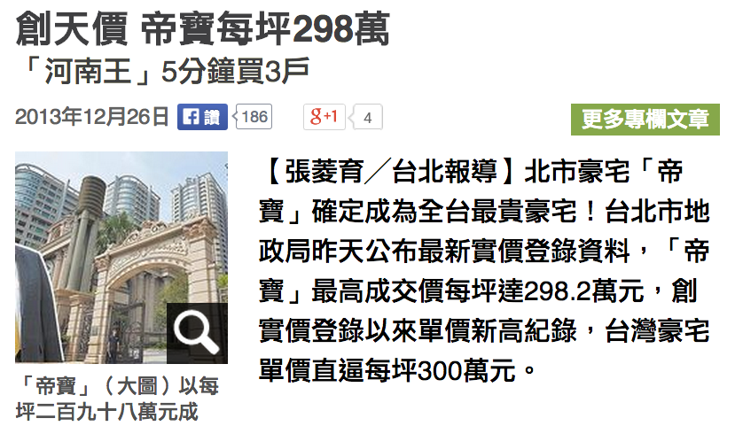
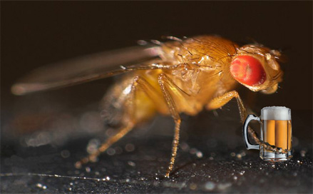
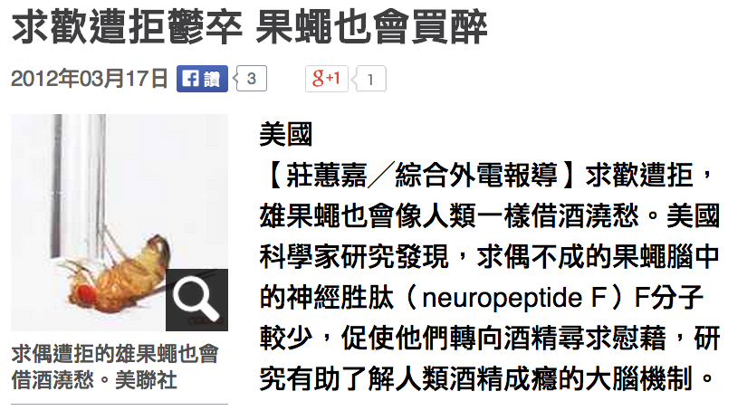
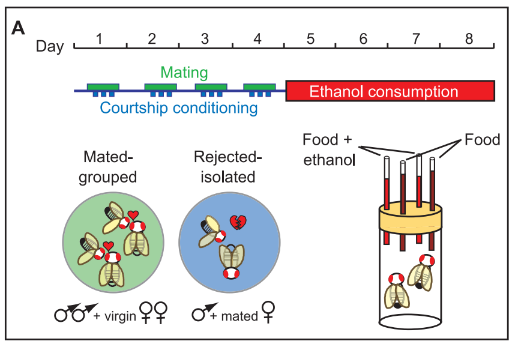
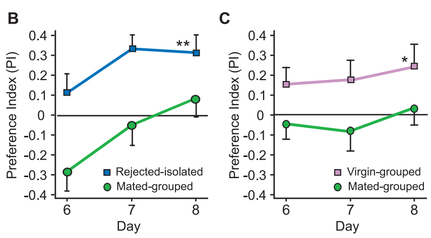
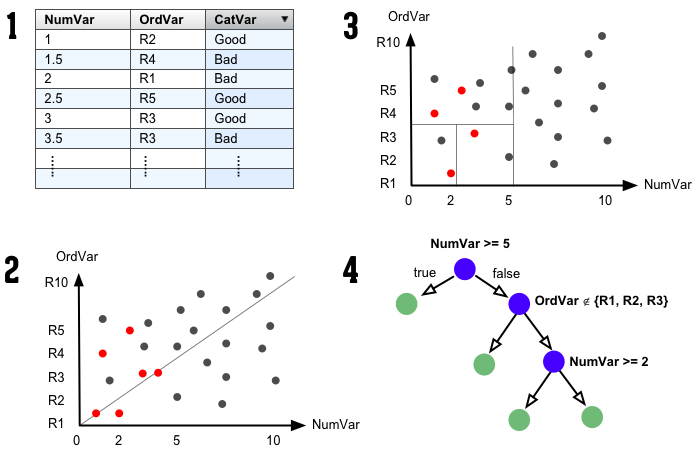

```{r setup, include=FALSE,echo = F, message = F, warning = F, tidy = F}
# make this an external chunk that can be included in any file
options(width = 100,digits=3)
opts_chunk$set(message = FALSE, eval=TRUE,fig.align = "center", warning = FALSE, comment = NA, dpi = 100, fig.width=6, fig.height=4.5,tidy = FALSE, cache = FALSE)

options(xtable.type = 'html')
knit_hooks$set(inline = function(x) {
  if(is.numeric(x)) {
    round(x, getOption('digits'))
  } else {
    paste(as.character(x), collapse = ', ')
  }
})
knit_hooks$set(plot = knitr:::hook_plot_html)
```
## When to use R?
<font size="+3">
1. Simulation & testing ideas<p>
2. Statistical analysis<p>
3. Data mining and machine learning<p>
4. Data visualzation (Ben's talk)
</font>

--- .segue .dark
## Simulation & testing idea in R

---
## Monty Hall problem
假設你參加一個遊戲節目，你被要求在三扇門中選擇一扇：其中一扇後面有一輛車；其餘兩扇後面則是山羊。你選擇一道門，假設是一號門，然後知道門後面有甚麼的主持人，開啟了另一扇後面有山羊的門，假設是三號門。他然後問你：「你想選擇二號門嗎？」轉換你的選擇對你來說是一種優勢嗎？
<center>
<br>
<br>
<font size="2">http://en.wikipedia.org/wiki/File:Monty-CurlyPicksCar.svg</font><br>
<font size="2">http://en.wikipedia.org/wiki/File:Monty_open_door.svg</font>
</center>

---
## Monty Hall problem
假設你參加一個遊戲節目，你被要求在三扇門中選擇一扇：其中一扇後面有一輛車；其餘兩扇後面則是山羊。你選擇一道門，假設是一號門，然後知道門後面有甚麼的主持人，開啟了另一扇後面有山羊的門，假設是三號門。他然後問你：「你想選擇二號門嗎？」轉換你的選擇對你來說是一種優勢嗎？
```{r cache=TRUE}
B <- 10000
x <- y1 <- y2 <- rep(0,B)
for(i in 1:B){
  x[i] <- sample(1:3,1)
  y1[i] <- 1
  y2[i] <- ifelse(x[i]==1, sample(c(2,3),1), x[i])
}
data.frame("keep"=mean(x==y1), "change"=mean(x==y2))
```

---
## Secretary problem
要聘請一名秘書，有 $n$ 個應聘者。每面試一人後就要決定是否聘他，如果不聘他，他便不會回來。面試後總能清楚了解應聘者的合度，並能和之前的人做比較。問什麼樣的策略，才使最佳人選被選中的機率最大。

這個問題的最優解是一個停止規則。在這個規則里，面試官會拒絕頭 $r - 1$ 個應聘者（令他們中的最佳人選為 應聘者 $M$），然後選出第一個比 $M$ 好的應聘者。

<center>
<br>
<font size="2">http://www.wallpapergate.com/wallpaper22876.html</font>
</center>

---
## Secretary problem
```{r cache=TRUE, eval=FALSE}
n <- 8; reps <- 10^4; rec <- rep(NA, reps)
out <- data.frame("size"=n, "cutoff"=1, "successrate"=1/n)
for(r in 2:n){
  for(k in 1:reps){
    a <- sample(1:n)
    comp <- min(a[1:r-1])
    sec <- a[n] #Last one
    for(i in r:n-1){
      if(a[i] < comp){
        sec <- a[i]
        break
      }
    }
    rec[k] <- sec
  }
  out[r,] <- rbind("size"=n, "cutoff"=r, "successrate"=sum(rec==1)/reps)
}
```

---
## Secretary problem
```{r cache=TRUE, eval=TRUE, echo=FALSE}
n <- 8; reps <- 10^4; rec <- rep(NA, reps)
out <- data.frame("size"=n, "cutoff"=1, "successrate"=1/n)
for(r in 2:n){
  for(k in 1:reps){
    a <- sample(1:n) # rank of applicants
    comp <- min(a[1:r-1]) #best one befor rth applicant
    sec <- a[n] #Last one
    for(i in r:n-1){
      if(a[i] < comp){ #choose ith applicant better than comp
        sec <- a[i]
        break
      }
    }
    rec[k] <- sec
  }
  out[r,] <- rbind("size"=n, "cutoff"=r, "successrate"=sum(rec==1)/reps)
}
```
```{r}
out
out[which.max(out$successrate),]
```

---
## Polls analysis
<center>  <br>
<font size="2">http://www.youtube.com/watch?v=W93QmbSB4ow</font></center>

---
## Polls analysis
 

訪問主題：台北市長可能人選民調

訪問時間：102 年 12 月 26 日至 30 日晚間 18：30-22：00 

調查方法：電話後四碼電腦隨機抽樣，人員電話訪問 

有效樣本：1,025 位 20 歲以上台北市民 

抽樣誤差：95%信心水準下，抽樣誤差為±3.1 個百分點 

---
## Polls analysis
- 柯文哲 ($p_1$)：47% ± 3.1% = (43.9%, 50.1%)
- 連勝文 ($p_2$)：44% ± 3.1% = (40.9%, 47.1%)
- 柯與連競爭的勝率之估計為何？

```{r}
n <- 1025 #樣本數
p1 <- 0.47 #柯的支持度估計
p2 <- 0.44 #連的支持度估計
d12 <- p1 - p2 
s12.diff <- sqrt(p1*(1-p1)/n+p2*(1-p2)/n+2*p1*p2/n) 
t <- d12/s12.diff
data.frame("差異"=d12, "標準誤"=s12.diff, "Z值"=t, "勝率"=pnorm(t))
```
<font size="2">Ref: http://www.pmean.com/04/MultinomialProportions.html</font>

--- .segue .dark
## Statistical analysis in R


---
<center><br>
<font size="2">http://arthritisbroadcastnetwork.org/2012/04/men-with-chronic-low-back-pain-may-have-reduced-bmd/</font>
</center>


---
## Bone Mineral Density
美國青少年脊柱骨質密度相對成長資料<br>
資料來源：Bachrach et al. (1999)
```{r cache=TRUE}
library(ElemStatLearn)
data(bone) # BMD of 261 north american adolescents
bone[sample(nrow(bone), 8),]
```

---
## Bone Mineral Density
美國青少年脊柱骨質密度相對成長資料<br>
觀察年齡與骨質密度相對成長之散佈圖
```{r cache=TRUE, echo=FALSE}
par(mar=c(4,4,1,1), cex.lab=1.3, cex.axis=1.3)
plot(spnbmd ~ age, data=bone, xlab="Age", ylab="Relative Change in BMD")
```

---
## Bone Mineral Density
美國青少年脊柱骨質密度相對成長資料<br>
觀察年齡與骨質密度相對成長之散佈圖
```{r cache=TRUE, echo=FALSE}
par(mar=c(4,4,1,1), cex.lab=1.3, cex.axis=1.3)
plot(spnbmd ~ age, data=bone, xlab="Age", ylab="Relative Change in BMD")
abline(lm(spnbmd ~ age, data=bone), lwd=2)
```

---
## Bone Mineral Density
美國青少年脊柱骨質密度相對成長資料<br>
以性別分組，觀察年齡與骨質密度相對成長之散佈圖
```{r cache=TRUE, echo=FALSE}
par(mar=c(4,4,1,1), cex.lab=1.3, cex.axis=1.3)
plot(spnbmd ~ age, data=bone, col = ifelse(gender=="male", 4, 2), 
     xlab="Age", ylab="Relative Change in BMD")
legend("topright", c("male", "Female"), col=c(4, 2), pch=1, bty="n", cex=1.2)
```

---
## Bone Mineral Density
美國青少年脊柱骨質密度相對成長資料<br>
利用平滑曲線法 (smooth splines) 觀察不同性別之趨勢
```{r cache=TRUE, echo=FALSE, eval=TRUE}
par(mar=c(4,4,1,1), cex.lab=1.3, cex.axis=1.3)
sp.male <- with(subset(bone,gender=="male"), smooth.spline(age, spnbmd, df=12))
sp.female <- with(subset(bone, gender=="female"), smooth.spline(age, spnbmd, df=12))
col <- adjustcolor(c(4, 2), 0.5)
plot(spnbmd ~ age, data=bone, col = ifelse(gender=="male", col[1], col[2]), 
     xlab="Age", ylab="Relative Change in BMD")
lines(sp.male, col=2, lwd=5)
lines(sp.female, col=4, lwd=5)
legend("topright", c("male", "Female"), col=c(4, 2), lwd=2, bty="n", cex=1.2)
```


---
## Bone Mineral Density
```{r cache=TRUE, echo=TRUE, eval=FALSE}
# 骨質密度成長率 vs 年齡
plot(spnbmd ~ age, data=bone, xlab="Age", ylab="Relative Change in BMD")
abline(lm(spnbmd ~ age, data=bone), lwd=2)

# 以性別分層
plot(spnbmd ~ age, data=bone, col = ifelse(gender=="male", 4, 2), 
     xlab="Age", ylab="Relative Change in BMD")
legend("topright", c("male", "Female"), col=c(4, 2), pch=1, bty="n", cex=1.2)

# 平滑曲線分析
sp.male <- with(subset(bone,gender=="male"), smooth.spline(age, spnbmd, df=12))
sp.female <- with(subset(bone, gender=="female"), smooth.spline(age, spnbmd, df=12))
plot(spnbmd ~ age, data=bone, col = ifelse(gender=="male", 4, 2), 
     xlab="Age", ylab="Relative Change in BMD", pch=1)
lines(sp.male, col=4, lwd=5)
lines(sp.female, col=2, lwd=5)
legend("topright", legend=c("male", "Female"), col=c(4, 2), lwd=2, bty="n", cex=1.2)
```

---
<center></center>

---
<center></center>
<font size="2">http://www.appledaily.com.tw/appledaily/article/property/20131202/35478355/</font>

---
## 帝寶房價預測
* 資料來源：不動產實價登錄資料 (2012年8月 ~ 2013年9月)
* 頂級豪宅 40 / 21530 件
* 加入物件的面積大小、是否購買車位、屋齡、行政區域、樓層高低等因子配適模型

```{r cache=TRUE}
library(mgcv) #provides functions for generalized additive modelling
dat1 <- readRDS("dat1.rds")
# fit linear model
g1 <- lm(log10(總價)~面積+車位+屋齡+行政區+floor, data=dat1)
# fit addiive model with two smooth terms
g2 <- gam(log10(總價)~s(面積)+車位+s(屋齡)+行政區+floor, data=dat1)
# Compare adjusted R-squared, 越趨近1模型配適度越好
data.frame("linear model"=summary(g1)$adj.r.sq, "additive model"=summary(g2)$r.sq)
```

---
## 帝寶房價預測
```{r cache=TRUE, echo=FALSE, fig.width=9, fig.height=4.5}
par(family="STHeiti", cex=1.2, mfrow=c(1,2))
plot(g2, select=1, lwd=2)
abline(h=g1$coefficients[["面積"]], lwd=2, col=2)
legend("topleft", c("Smooth term", "Linear term"), col=1:2, lty=1, lwd=2, bty="n")
plot(g2, select=2, lwd=2)
abline(h=g1$coefficients[["屋齡"]], lwd=2, col=2)
```

---
## 帝寶房價預測
```{r cache=TRUE, eval=FALSE}
# set dataset, 帝寶格局
new <- dat1[1:6, c(2,3,4,6,7,12)]
rownames(new) <- 1:6
new$面積 <- c(160,160,210,210,260,260)
new$車位 <- rep("有車位",6); 
new$屋齡 <- rep(8, 6)
new$行政區 <- rep("大安區",6)
new$floor <- rep(c("低樓層","高樓層"),3)
# prediction
tmp <- predict(g2, newdata=new, se.fit=TRUE)
pred <- 10^cbind(tmp$fit, tmp$fit-tmp$se.fit, tmp$fit+tmp$se.fit)
data.frame("建案坪數"=new$面積, "高低樓層"=new$floor, 
           "總價估計.萬元"=round(pred[,1]/10000),
           "單價估計.萬元"=round(pred[,1]/10000/new$面積))
```

---
## 帝寶房價預測 (http://goo.gl/vT1Smr)


---
<center></center>
<font size="2">http://www.appledaily.com.tw/appledaily/article/property/20131226/35533557/</font>

---
<center>
<font size="2">http://www.bio1000.com/news/1/1867.html</font>
</center>

---
<center></center>
<font size="2">http://www.appledaily.com.tw/appledaily/article/international/20120317/34096123/</font>

---
<center></center><br>
<font size="2">Shohat-Ophir, G., et al. (2012) https://www.sciencemag.org/content/335/6074/1351</font>

---
<center></center><br>
<font size="2">Shohat-Ophir, G., et al. (2012) https://www.sciencemag.org/content/335/6074/1351</font>

---
### 借酒澆愁愁更愁－探討果蠅求偶被拒絕與其飲酒行為之關聯性 
- 學校名稱：國立科學工業園區實驗高級中學
- 作者：陳慶豐、陳昌逸； 指導老師：馮蕙卿、揭維邦

```{r cache=TRUE}
# raw data
dat <- data.frame(id=rep(1:8, each=2),
                  type=rep(c("glucose", "ethanol"), times=8, each=1),
                  group=rep(c("reject", "mate"), times=1, each=8),
                  ml=c(2.054, 3.677, 1.626, 3.078, 1.840, 3.378, 2.054, 2.694,
                       2.054, 2.993, 3.680, 2.223, 2.097, 2.608, 3.337, 1.753))
head(dat)
```

---
### 借酒澆愁愁更愁－探討果蠅求偶被拒絕與其飲酒行為之關聯性
```{r cache=TRUE, echo=FALSE}
tmp <- rep(0, 8)
for(i in 1:8) {
  tmp[i] <- ((dat$ml[2*i] - dat$ml[2*i-1])/(dat$ml[2*i] + dat$ml[2*i-1]))
}
out <- data.frame("reject"=tmp[1:4], "mate"=tmp[5:8]) 
PI.mean <- apply(out, 2, mean) 
PI.sd <- apply(out, 2, sd)
library(Hmisc)
par(cex=1.2)
errbar(x=1:2, y=PI.mean, yplus=PI.mean+PI.sd, yminus=PI.mean-PI.sd, las=1,
       xaxt="n", xlim=c(0.5,2.5), xlab="", ylab="Preference index", cex=1.5, lwd=2)
axis(1, at=1:2, c("Reject", "Mate")) 
abline(h=0, lty=2)
```

---
### 借酒澆愁愁更愁－探討果蠅求偶被拒絕與其飲酒行為之關聯性
```{r cache=TRUE, eval=FALSE}
tmp <- rep(0, 8)
for(i in 1:8) {
  tmp[i] <- ((dat$ml[2*i] - dat$ml[2*i-1])/(dat$ml[2*i] + dat$ml[2*i-1]))
}
out <- data.frame("reject"=tmp[1:4], "mate"=tmp[5:8]) 
PI.mean <- apply(out, 2, mean) 
PI.sd <- apply(out, 2, sd)
library(Hmisc)
par(cex=1.2)
errbar(x=1:2, y=PI.mean, yplus=PI.mean+PI.sd, yminus=PI.mean-PI.sd, las=1,
       xaxt="n", xlim=c(0.5,2.5), xlab="", ylab="Preference index", cex=1.5, lwd=2)
axis(1, at=1:2, c("Reject", "Mate")) 
abline(h=0, lty=2)
```

---
<center>
<font size="2">http://i.gbc.tw/gb_img/5/001/991/1991405.jpg</font></center>

---
## LoL口袋深度分析
口袋深度：玩家在達到多少勝場時，能夠運用的英雄數量<br>
英雄聯盟中可供使用的英雄有100種以上，英雄與英雄之間有若干相剋情形<br>
會使用的英雄越多被針對的程度越低，因此口袋深度是判斷一個玩家程度的重要指標
```{r cache=TRUE, eval=FALSE}
library(devtools)
install_github('iNEXT','JohnsonHsieh') # http://johnsonhsieh.github.io/iNEXT/
library(iNEXT) # Chao et al. (2014)
source_url("https://gist.github.com/JohnsonHsieh/8389618/raw/qurey.R") # 戰績網查詢
id1 <- clean_lol("ahq_Westdoor"); id2 <- clean_lol("AZB_TPA_Morning")
out <- list("Westdoor"=id1$win, "Morning"=id2$win)
names(out[[1]]) <- id1$name; names(out[[2]]) <- id2$name
lapply(out, function(x) x[x>0])
```
```{r cache=TRUE, eval=TRUE, echo=FALSE}
library(devtools)
install_github('iNEXT','JohnsonHsieh') # http://johnsonhsieh.github.io/iNEXT/
library(iNEXT) # Chao et al. (2014)
source_url("https://gist.github.com/JohnsonHsieh/8389618/raw/qurey.R") # 戰績網查詢
id1 <- clean_lol("ahq_Westdoor"); id2 <- clean_lol("AZB_TPA_Morning")
out <- list("Westdoor"=id1$win)
names(out[[1]]) <- id1$name
lapply(out, function(x) x[x>0])
```


---
## LoL口袋深度分析 (http://goo.gl/KngyYO)
```{r cache=TRUE, eval=FALSE}
out1 <- iNEXT(id1$win, endpoint=100); out2 <- iNEXT(id2$win, endpoint=100)
par(family="STHeiti")
plot(out1, ylim=c(0,40), main="口袋深度分析", xlab="勝場數", ylab="英雄個數")
lines(out2, col=2)
legend("topleft", c("ahq_Westdoor", "AZB_TPA_Morning"), col=1:2, pch=19, bty="n", lty=1)
```

```{r cache=TRUE, echo=FALSE, eval=TRUE, fig.height=4, fig.width=6.5}
library(devtools)
install_github('iNEXT','JohnsonHsieh')
library(iNEXT) # http://johnsonhsieh.github.io/iNEXT/
source_url("https://gist.github.com/JohnsonHsieh/8389618/raw/qurey.R")

id1 <- clean_lol("ahq_Westdoor")
id2 <- clean_lol("AZB_TPA_Morning")
id3 <- clean_lol("冒險皮")
out1 <- iNEXT(id1$win, endpoint=100)
out2 <- iNEXT(id2$win, endpoint=100)
out3 <- iNEXT(id3$win, endpoint=100)

par(family="STHeiti", mar=c(5,4,1,1)+0.1, cex=1.2)
plot(out1, ylim=c(0,40), main="",
     xlab="勝場數 (虛線表示預測結果)", ylab="口袋深度（英雄個數）")
lines(out2, col=2)
lines(out3, col=3)
legend("topleft", c("ahq_Westdoor", "AZB_TPA_Morning", "TW.R_Wush"), 
       col=1:4, pch=19, bty="n", lty=1)
```

--- .segue .dark
## Data mining and machine learning in R

---
<center>
<br>
<font size="2">http://www.motherjones.com/files/images/Blog_Obama_Clinton.jpg</font>
</center>

---
## The Obama-Clinton Divide
```{r cache=TRUE}
primary = read.csv(url("http://www.stat.ucla.edu/~cocteau/primaries.csv"), head=TRUE) 
primary$black06pct <- primary$black06/primary$pop06  
primary <- subset(primary, state_postal!="MI") 
primary <- subset(primary, state_postal!="FL") 
primary <- subset(primary, !(state_postal=="WA" & racetype=="Primary")) 
primary.sub <- subset(primary, select=c(county_name, region, winner,
                                        clinton, obama, pct_hs_grad, black06pct))
head(primary.sub)
```

---
<iframe src="http://www.nytimes.com/imagepages/2008/04/16/us/20080416_OBAMA_GRAPHIC.html" width="70%" height="601"></iframe> 

---


---
## The Obama-Clinton Divide
```{r cache=TRUE, eval=FALSE}
library(rpart) # Recursive partitioning
library(rpart.plot) # Fancy tree plot
library(RColorBrewer) # Nice color palettes
fit = rpart(winner~region+pct_hs_grad+black06pct,data=primary)
c1 <- ifelse(fit$frame$yval==1, brewer.pal(9, "Greens")[9], brewer.pal(9, "Blues")[9])
c2 <- ifelse(fit$frame$yval==1, brewer.pal(9, "Greens")[2], brewer.pal(9, "Blues")[2])
prp(fit, type=2, extra=1, col=c1, box.col=c2, shadow.col="gray")
```

---
## The Obama-Clinton Divide
```{r cache=TRUE, echo=FALSE, eval=TRUE, fig.height=5.5}
library(rpart) # Recursive partitioning
library(rpart.plot) # Fancy tree plot
library(RColorBrewer) # Nice color palettes
primary = read.csv(url("http://www.stat.ucla.edu/~cocteau/primaries.csv"), head=TRUE) 
# transformations data 
primary$black06pct <- primary$black06/primary$pop06 
primary$hisp06pct <- primary$hisp06/primary$pop06 
primary$white06pct <- primary$white06/primary$pop06 
primary$growth <- 100*(primary$pop06/primary$pop00 - 1) 
primary <- subset(primary, state_postal!="MI") 
primary <- subset(primary, state_postal!="FL") 
primary <- subset(primary, !(state_postal=="WA" & racetype=="Primary")) 

fit = rpart(winner~region+pct_hs_grad+black06pct,data=primary)
c1 <- ifelse(fit$frame$yval==1, brewer.pal(9, "Greens")[9], brewer.pal(9, "Blues")[9])
c2 <- ifelse(fit$frame$yval==1, brewer.pal(9, "Greens")[2], brewer.pal(9, "Blues")[2])
prp(fit, type=2, extra=1, col=c1, box.col=c2, shadow.col="gray")
```

---
## How do decision tree work
<center></center>
<font size="2">https://github.com/braz/DublinR-ML-treesandforests/</font>

---
```{r cache=TRUE, echo=FALSE, eval=TRUE, fig.height=6.3, fig.width=8.1}
library(ElemStatLearn)
data(zip.train)
dat <- zip.train[which(zip.train[,1]==3),]
tmp1 <- tmp2 <- list()
for(i in 1:9){
  for(j in 1:7){
    tmp1[[j]] <- matrix(dat[i+(j-1)*5, ][-1], 16,16)[,16:1]
  }
  tmp2[[i]] <- do.call("cbind", tmp1)
}
im <- do.call("rbind",tmp2)
image(im, col=gray(256:0/256), xlab="", ylab="", axes=FALSE)
```

---
## Handwritten digits
```{r echo=TRUE, eval=FALSE}
library(ElemStatLearn)
data(zip.train)
dat <- zip.train[which(zip.train[,1]==3),]
tmp1 <- tmp2 <- list()
for(i in 1:9){
  for(j in 1:7){
    tmp1[[j]] <- zip2image(dat, i+(j-1)*5)
  }
  tmp2[[i]] <- do.call("cbind", tmp1)
}
im <- do.call("rbind",tmp2)
image(im, col=gray(256:0/256), xlab="", ylab="", axes=FALSE)
```

---
## Handwritten digits
以Principal Component Analysis (PCA) 進行手寫學習<br>
<center></center>
```{r cache=TRUE, echo=TRUE, eval=FALSE}
pca <- prcomp((dat[,-1]))
b1 <- b2 <- round(seq(-4, 4, l=5),1)
par(mfrow=c(1,3))
image(matrix(pca$center,16,16),col=gray(256:0/256), main="Mean")
image(matrix(pca$rotation[,1],16,16),col=gray(256:0/256), main="PC1")
image(matrix(-pca$rotation[,2],16,16),col=gray(256:0/256), main="PC2")
```

---
## Handwritten digits
以Principal Component Analysis (PCA) 進行手寫學習<br>
```{r cache=TRUE, echo=FALSE}
pca <- prcomp((dat[,-1]))
b1 <- b2 <- round(seq(-4, 4, l=5),1)
```

```{r cache=TRUE, echo=FALSE, fig.height=4.5, fig.width=9}
par(mfrow=c(1,2))
tmp3 <- tmp4 <- list()
for(i in 1:5){
  for(j in 1:5){
    tmp3[[j]] <- matrix(pca$center,16,16) + 
                 b1[i]*matrix(pca$rotation[,1],16,16) + 
                 b2[j]*matrix(-pca$rotation[,2],16,16)
  }
  tmp4[[i]] <- do.call("cbind", tmp3)
}
pc.im <- do.call("rbind",tmp4)
plot(pca$x[,1:2], col=3, xlim=c(-6,6), pch=19, cex=0.5, panel.first = grid(6,6,1,2))
abline(v=0, col=gray(0.2), lwd=2)
abline(h=0, col=gray(0.2), lwd=3)
points(x = rep(b1,each=6), y=rep(b2, times=6), col=2, pch=19)
image(pc.im, col=gray(256:0/256), zlim=c(-0.8,1.2), axes=FALSE, xlab="PC1", ylab="PC2")
axis(1, at=seq(0,1,l=5), labels=b1); axis(2, at=seq(0,1,l=5), labels=b2)

```

---
## Handwritten digits
```{r eval=FALSE}
tmp3 <- tmp4 <- list()
for(i in 1:5){
  for(j in 1:5){
    tmp3[[j]] <- matrix(pca$center,16,16) + 
                 b1[i] * matrix(pca$rotation[,1],16,16) + 
                 b2[j] * matrix(-pca$rotation[,2],16,16)
  }
  tmp4[[i]] <- do.call("cbind", tmp3)
}
pc.im <- do.call("rbind",tmp4)
plot(pca$x[,1:2], col=3, xlim=c(-6,6), pch=19, cex=0.5, panel.first = grid(6,6,1,2))
abline(v=0, col=gray(0.2), lwd=2)
abline(h=0, col=gray(0.2), lwd=3)
points(x = rep(b1,each=6), y=rep(b2, times=6), col=2, pch=19)
image(pc.im, col=gray(256:0/256), zlim=c(-0.8,1.2), axes=FALSE, xlab="PC1", ylab="PC2")
axis(1, at=seq(0,1,l=5), labels=b1)
axis(2, at=seq(0,1,l=5), labels=b2)
```

---
## Basic idea behind PCA 

<font size="2">http://www.nlpca.org/fig_pca_principal_component_analysis.png</font>

---
## Resources
<table border=1>
  <td width=30%>
    Useful R websites
  </td>
  <td width=35%>
    Basic statistics book with R
  </td>
  <td width=35%>
    Advanced statistics book with R
  </td>
  <tr>
  <td width=30%>
    <ul>
      <li> <a href="http://www.statmethods.net/">Quick-R</a>
      <li> <a href="http://www.r-bloggers.com/">R-bloggers</a>
      <li> <a href="http://stackoverflow.com/tags/r">StackOverflow</a>
      <li> <a href="http://www.ptt.cc/bbs/R_Language/index.html">R_Language@ptt.cc</a>
  </td>
  <td width=35%>
    <a href="http://health.adelaide.edu.au/psychology/ccs/teaching/lsr/"></a>
  </td>
  <td width=35%>
    <a href="http://statweb.stanford.edu/~tibs/ElemStatLearn/"></a>
  </td>
</table>

---
## Come back for more
- Sign up at: [www.meetup.com/Taiwan-R/](http://www.meetup.com/Taiwan-R)
- Give feedback at: [www.facebook.com/Tw.R.User](https://www.facebook.com/Tw.R.User)
- MLDM Monday VOD at: [www.youtube.com/user/TWuseRGroup](https://www.youtube.com/user/TWuseRGroup)

<center></center>


